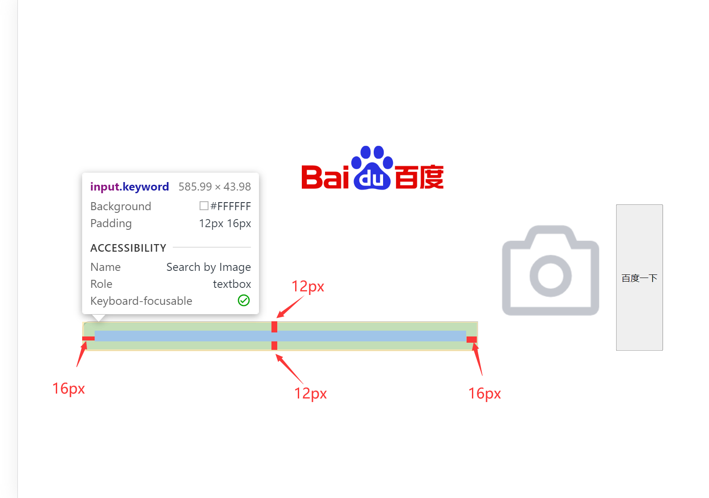

# CSS Start Up

Source Code Repository

[Source Code](https://github.com/ThankRain/baidu-sample.git)

Sample Preview:

[baidu-sample.vercel.app ](https://baidu-sample.vercel.app/)

I believe half of us has been learned the Computer Network Technology and Application. And you must have been tried to
make an static web page by HTML(Hyper Text Mark-up Language) , also a "dynamic" page by JavaScript.

All the web page are created by **HTML**, **JavaScript**, and **CSS**. But it seems that it was quite impossible to
imitate for us.

That must be we have forgotten something. That must be **CSS**!

## CSS

CSS, whose full name was **Cascading Style Sheets** *(层叠样式表)* , can decorate the page with attributes.

With CSS, it looks normal:


Without CSS, all the page are rubbish:


Just left the frame created by HTML.

So let's start up build web page by CSS!

## Start Up With HTML

let's make some basic elements which are essential in a web page.


Then, let's check what elements we need if we want to make a search index page:


One image *(the first two are unnecessary because we could not see it on the page directly)*,one input element with a
camera image, and a button that enables us to search.

OK, let's write the HTML frame:


One image as the logo, and a form to submit the search request to Baidu. Yet the label combines the input element and
the camera icon. Finally with one button. It looks like this:


## Start Up With CSS

### Make Everything in the Center

CSS is written in the `<style>` tag, write these CSS to make everything in the center (horizontal) of the page

```html

<style>
    body {
        display: flex;
        flex-direction: column;
        align-items: center;
    }
</style>
```


```CSS
body {
    < block >
}
```

The `body` claims that the attributes in the block can only take effect to the `<body>` element.

```CSS
display: flex

;
```

The `display` claims that the elements in the `body` would display with the designated type `flex`, that enables
elements arranged by column or row

```CSS
flex-direction: column

;
```

This code appoints that the elements arrange direction is vertical.

```CSS
align-items: center

;
```

This code appoints that all the elements will align in the center of the parent. Here are the actual effect:


All the elements are in the center (horizontally) !

### Adjust The Logo

Let's adjust the size of the logo.

Write these codes in the `<style>` tag:

```CSS
        .logo {
    width: 270px;
    height: 129px;
    margin-top: 160px;
    margin-bottom: 9px;
}
```


The `.logo` claims that it will take effect the element which has the attributes `class="logo"`, the `.` stand
for `class` here. The `width` and `height` set the logo image's width and height, the `px` means `pixel`*(像素)*
And the `margin-top` and the `margin-bottom` appoint that the element far from the top element `160px` and far from the
bottom element `9px`
Here is the effect:

Here are the explanation


### Adjust the input

Similarly, we adjust the input and form

```CSS
        form {
    display: flex;
    flex-direction: row;
}

.keyword {
    width: 550px;
    height: 16px;
    padding: 12px 16px;
    border-radius: 10px 0 0 10px;
    border: 2px solid #c4c7ce;
}
```


This is the `padding` effect.


This is the effect of `border-radius:10px 0 0 10px`,which
means`boder-radius: left-top right-top right-bottom left-bottom`

### Adjust Camera

Next is adjust the camera:

```CSS
        .camera {
    width: 24px;
    height: 24px;
    position: absolute;
    top: 50%;
    margin-top: -12px;
    right: 16px;
}

label {
    position: relative;
}
```


The effect:


### Finally Adjust the Button

```CSS
        .button {
    height: 44px;
    width: 108px;
    background-color: #4e6ef2;
    border-radius: 0 10px 10px 0;
    color: white;
    border: none;
    z-index: 2;
    margin-left: -2px;
    box-sizing: border-box;
    font-size: 17px;
}
```


The ultimately effect:


For deep learning:

[CSS 教程 (w3school.com.cn)](https://www.w3school.com.cn/css/index.asp)
